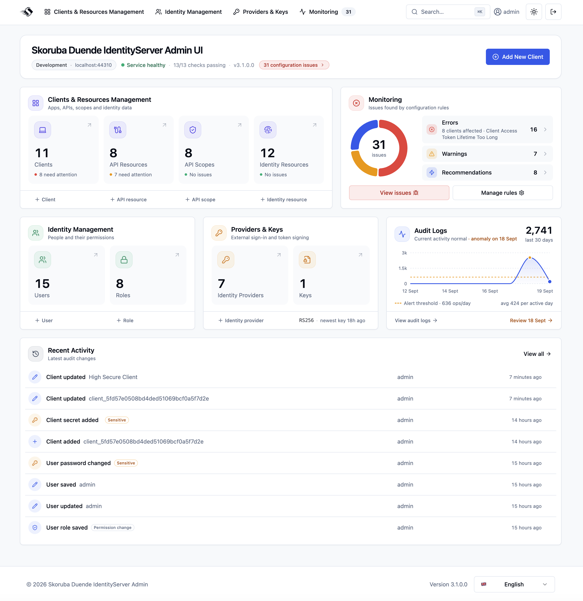
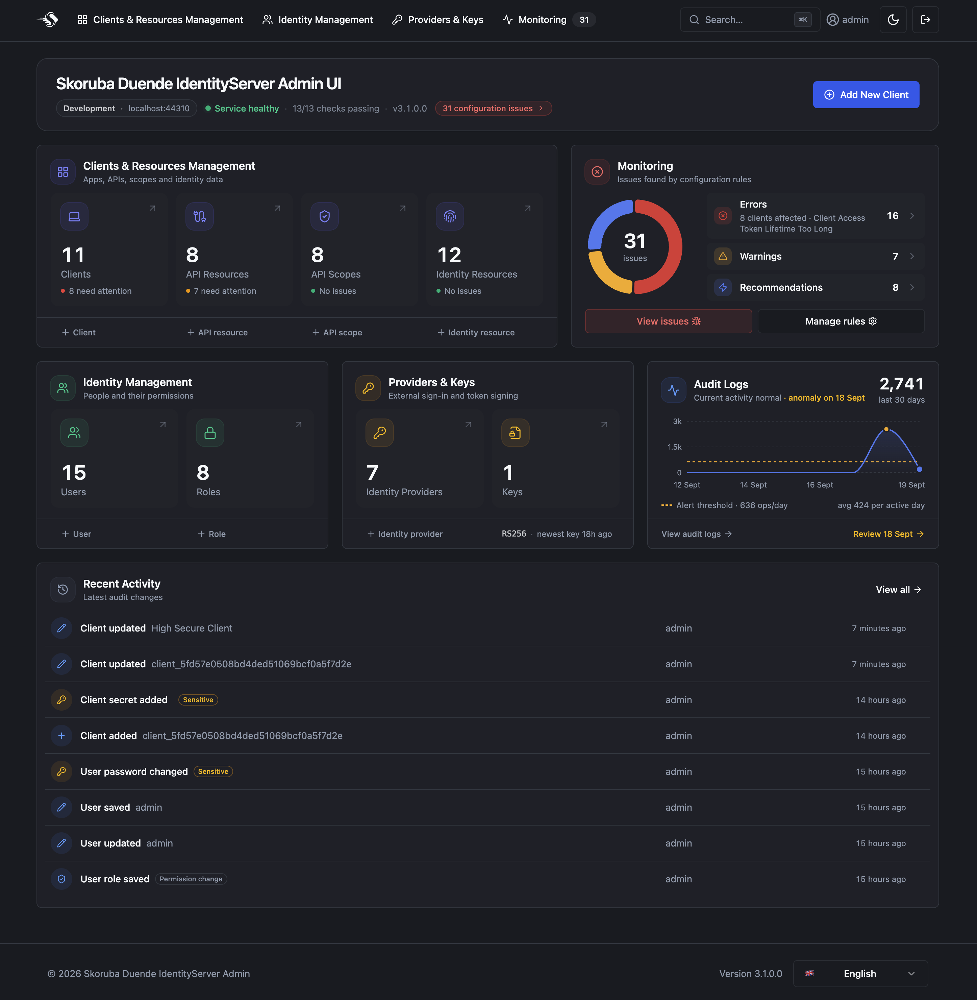
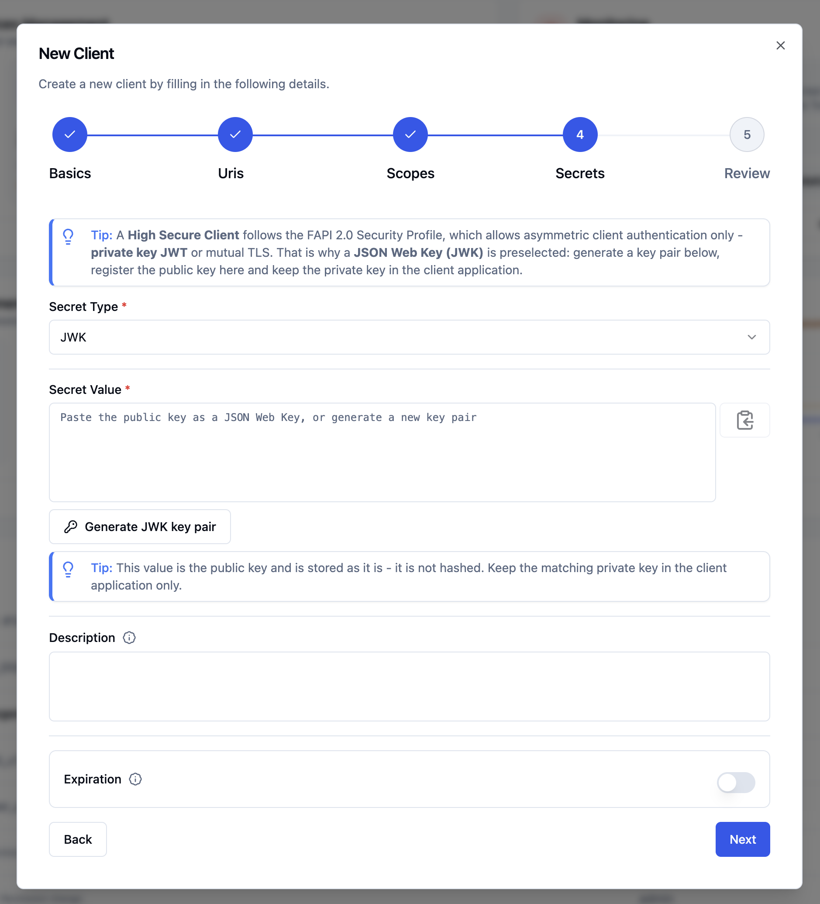
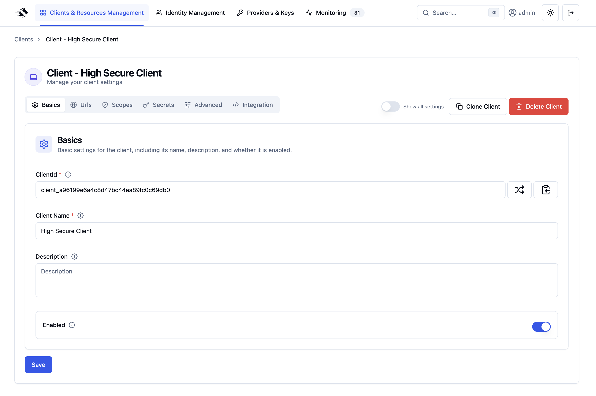
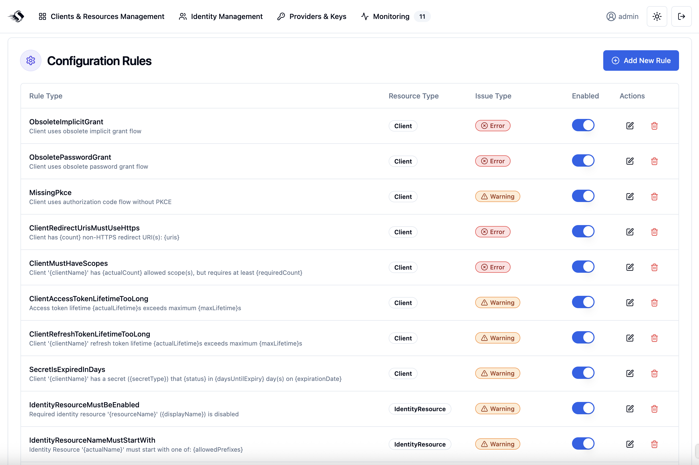
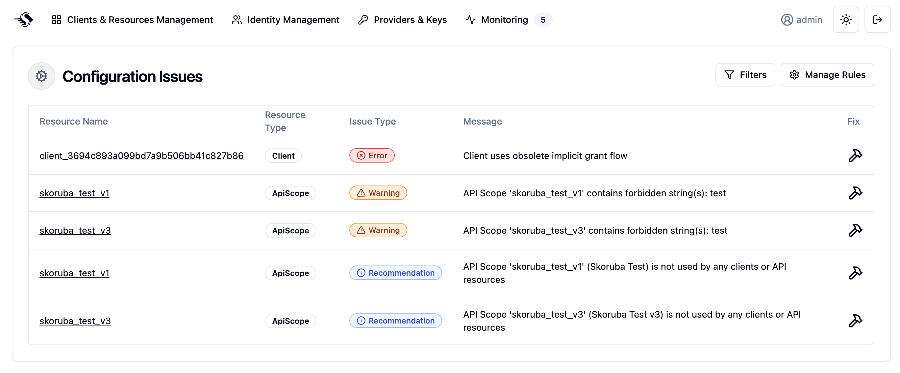
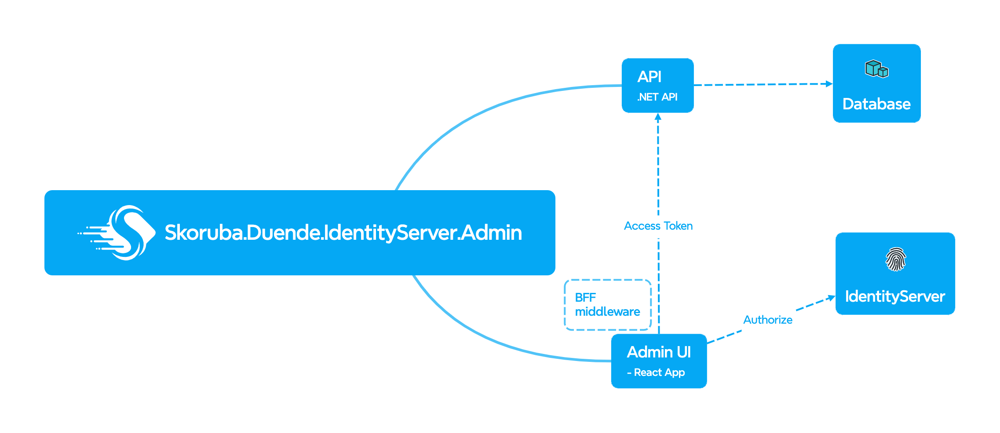

<div align="center">


# Skoruba Duende IdentityServer Admin

### Modern administration UI for Duende IdentityServer and ASP.NET Core Identity

Manage IdentityServer clients and resources, ASP.NET Core Identity users and roles,
configuration health, auditing, and security from one modern interface.

<br />

[](https://dotnet.microsoft.com/)
[](https://react.dev/)
[](LICENSE)
[](https://discord.gg/qTqQCSKWkX)

<br />

[**Installation**](#-installation-via-dotnet-new-template) ·
[**Local Development**](#-quick-start--local-development) ·
[**Docker**](#-running-via-docker-optional) ·
[**Roadmap**](#-roadmap--changelog) ·
[**Discord**](https://discord.gg/qTqQCSKWkX)

</div>

<br />

<p align="center">
  
</p>

> [!IMPORTANT]
>
> ## Version 3.1.0 is here 🚀
>
> **Version 3.1.0** moves the solution to **Duende IdentityServer 8**, on top of the
> redesigned administration experience introduced in 3.0.0 and built with
> **React, TypeScript, Tailwind CSS, shadcn/ui, and .NET 10**.
>
> It also adds **JWK client secrets** with in-browser key pair generation, new
> **configuration rules** for client naming and orphaned scopes, and a set of
> security and performance fixes.
>
> ⚠️ Upgrading from 3.0.0 requires new EF migrations. See the
> [changelog](CHANGELOG.md) for details, and note that managing SAML service
> providers from the Admin UI is not part of this release.
>
> See the [roadmap and changelog](#-roadmap--changelog) for release history and upcoming features.

---

## Highlights

|     | Area                  | Highlights                                                                  |
| --- | --------------------- | --------------------------------------------------------------------------- |
| 🧭  | **New Admin UI**      | React, TypeScript, Tailwind CSS, and shadcn/ui                              |
| ⚙️  | **Modern backend**    | .NET 10 and Duende IdentityServer 8.0.2                                     |
| 📊  | **Monitoring**        | Dashboards, configuration rules, and issue tracking                         |
| 🧙  | **Client management** | Improved workflows and guided client creation wizard                        |
| 🔐  | **Authentication**    | Passkey support in STS Identity                                             |
| 🧩  | **Mapping**           | Mapperly-based mapping pipeline and customization points                    |
| 🛡️  | **Security**          | Hardened audit logging and stronger validation                              |
| 🧪  | **Quality**           | Expanded Playwright UI, Admin API, STS, repository, and audit test coverage |

---

## Contents

- [Administration UI Preview](#administration-ui-preview)
- [Prerequisites](#-prerequisites)
- [Installation via `dotnet new` Template](#-installation-via-dotnet-new-template)
- [Quick Start – Local Development](#-quick-start--local-development)
- [Running via Docker](#-running-via-docker-optional)
- [EF Core & Data Access](#️-ef-core--data-access)
- [Authentication & Authorization](#-authentication--authorization)
- [Azure Key Vault Integration](#-azure-key-vault-integration)
- [Logging](#-logging)
- [Audit Logging](#-audit-logging)
- [External Authentication Providers](#-external-authentication-providers)
- [Email Service](#-email-service)
- [Health Checks](#-health-checks)
- [Localization](#-localization)
- [API & Swagger](#-api--swagger)
- [STS Configuration](#️-sts-configuration)
- [Identity Mapping Customization](#-identity-mapping-customization)
- [Solution Overview](#-solution-overview)
- [Roadmap & Changelog](#-roadmap--changelog)
- [License](#-license)
- [Acknowledgements](#-acknowledgements)
- [Contact & Support](#-contact--support)

---

## Administration UI Preview

Explore the redesigned administration experience, built with **Tailwind CSS** and **shadcn/ui** components.

### 🌙 Dashboard (Dark)



### 🧙‍♂️ Client Creation – Wizard Flow



### 💼 Client Management



### 📡 Monitoring

Define and track configuration rules for clients, API resources, and identity resources:

- Flag deprecated OAuth 2.1 flows
- Enforce required scopes
- Validate naming conventions for clients, scopes, and resources
- Detect client scopes that no longer exist
- Warn about expired client secrets

#### 🧱 Configuration Rules



#### 🧩 Configuration Issues



### Solution Structure



---

## ✅ Prerequisites

- .NET 10 SDK
- Node.js 18+ and npm (required for the React client)
- SQL Server (default LocalDB) or PostgreSQL
- Duende IdentityServer 8.0.2

> **Note:** Using older .NET versions may cause 502.5 errors on IIS or application startup failures.

---

## 📦 Installation via dotnet new Template

> 🔒 **Database note:**  
> This template includes default EF migrations. Review them and back up your database before applying.

> ℹ️ **Migration note from IdentityServer4.Admin:**  
> The `UserSecretsId` for Admin, Admin API, and STS projects remains the same as in the older `Skoruba.IdentityServer4.Admin` solution to ease config migration. If you still have secrets from the old project on your machine, they will be reused (e.g., `ApplySeed` could point at your old DB). Change or clear user secrets if you need isolation.

### 1. Install the template

```sh
dotnet new install Skoruba.Duende.IdentityServer.Admin.Templates::3.1.0
```

### 2. Create a new project

```sh
dotnet new skoruba.duende.isadmin \
  --name MyProject \
  --title MyProject \
  --adminemail "admin@example.com" \
  --adminpassword "Passw0rd-123" \
  --adminrole MyRole \
  --adminclientid MyClientId \
  --adminclientsecret MyClientSecret \
  --dockersupport true \
  --requirepushedauthorization true
```

### Template Options

| Option                         | Description                                                                                                                                                                                                       |
| ------------------------------ | ----------------------------------------------------------------------------------------------------------------------------------------------------------------------------------------------------------------- |
| `--name`                       | Project name                                                                                                                                                                                                      |
| `--title`                      | Admin UI title and footer text                                                                                                                                                                                    |
| `--adminemail`                 | Initial admin email                                                                                                                                                                                               |
| `--adminpassword`              | Initial admin password                                                                                                                                                                                            |
| `--adminrole`                  | Role name used for admin authorization                                                                                                                                                                            |
| `--adminclientid`              | Client ID for the Admin UI OIDC client                                                                                                                                                                            |
| `--adminclientsecret`          | Client secret for the Admin UI OIDC client                                                                                                                                                                        |
| `--dockersupport`              | Include Docker support (`true` / `false`)                                                                                                                                                                         |
| `--requirepushedauthorization` | Require PAR for admin client (`true` / `false`, default `true`). **Note:** PAR requires Duende IdentityServer Business Edition or higher. [More info](https://docs.duendesoftware.com/identityserver/tokens/par/) |

---

## 🚀 Quick Start – Local Development

> **Note:** This section is for developers who want to clone and contribute to the repository. If you want to use the template, see the section above.

The solution contains **three runnable services**:

| Service       | Project                                      | Purpose                         |
| ------------- | -------------------------------------------- | ------------------------------- |
| **STS**       | `Skoruba.Duende.IdentityServer.STS.Identity` | IdentityServer + authentication |
| **Admin API** | `Skoruba.Duende.IdentityServer.Admin.Api`    | REST API backend                |
| **Admin UI**  | `Skoruba.Duende.IdentityServer.Admin`        | SPA host                        |

### 1. Clone the repository

```sh
git clone https://github.com/skoruba/Duende.IdentityServer.Admin
cd Duende.IdentityServer.Admin
```

### 2. Install React dependencies (first run only)

```sh
cd src/Skoruba.Duende.IdentityServer.Admin.UI.Client
npm install
cd ../..
```

### 3. Run the services

Open three terminals and run:

```sh
# Terminal 1: STS (IdentityServer)
cd src/Skoruba.Duende.IdentityServer.STS.Identity
dotnet run

# Terminal 2: Admin API
cd src/Skoruba.Duende.IdentityServer.Admin.Api
dotnet run

# Terminal 3: Admin UI Host
cd src/Skoruba.Duende.IdentityServer.Admin
dotnet run
```

### 4. Default local URLs

| Service       | URL                                                   |
| ------------- | ----------------------------------------------------- |
| **STS**       | https://localhost:44310                               |
| **Admin API** | https://localhost:44302                               |
| **Admin UI**  | Check console output (usually https://localhost:7127) |

> By default, database migrations and seed data are enabled in Admin API (`ApplyDatabaseMigrations`, `ApplySeed`).

---

## 🐳 Running via Docker (Optional)

> **Tip:** For the fastest onboarding, use the `dotnet run` approach above. Docker requires custom domain and certificates.

### DNS Configuration

Update your hosts file to resolve `skoruba.local`:

**Windows:** `C:\Windows\System32\drivers\etc\hosts`  
**Linux / macOS:** `/etc/hosts`

```text
127.0.0.1 skoruba.local sts.skoruba.local admin.skoruba.local admin-api.skoruba.local
```

### Certificates Setup

Use [mkcert](https://github.com/FiloSottile/mkcert) to generate self-signed local certificates.

#### Windows

```powershell
cd shared/nginx/certs
mkcert --install
copy $env:LOCALAPPDATA\mkcert\rootCA-key.pem ./cacerts.pem
copy $env:LOCALAPPDATA\mkcert\rootCA.pem ./cacerts.crt

# Generate skoruba.local certificates
mkcert -cert-file skoruba.local.crt -key-file skoruba.local.key skoruba.local *.skoruba.local
mkcert -pkcs12 skoruba.local.pfx skoruba.local *.skoruba.local
```

#### macOS / Linux

```bash
cd shared/nginx/certs
mkcert -install

# Copy root certificates (adjust paths for your system)
# macOS: ~/Library/Application\ Support/mkcert/
# Linux: ~/.local/share/mkcert/
cp "$(mkcert -CAROOT)/rootCA-key.pem" ./cacerts.pem
cp "$(mkcert -CAROOT)/rootCA.pem" ./cacerts.crt

# Generate skoruba.local certificates
mkcert -cert-file skoruba.local.crt -key-file skoruba.local.key skoruba.local *.skoruba.local
mkcert -pkcs12 skoruba.local.pfx skoruba.local *.skoruba.local
```

### Run Docker Compose

```sh
docker-compose build
docker-compose up -d
```

> Docker setup is based on [bravecobra's repository](https://github.com/bravecobra/identityserver-ui) – thanks! 😊

### Docker Images

Docker images are available on [Docker Hub](https://hub.docker.com/u/skoruba).

To publish images, check `build/publish-docker-images.ps1` and update the profile name.

---

## 🗄️ EF Core & Data Access

### DbContexts

The solution uses the following `DbContext` classes:

- `AdminIdentityDbContext` – ASP.NET Core Identity data
- `AdminLogDbContext` – Logging data
- `IdentityServerConfigurationDbContext` – IdentityServer configuration store
- `IdentityServerPersistedGrantDbContext` – IdentityServer operational store
- `AuditLoggingDbContext` – Audit logging
- `IdentityServerDataProtectionDbContext` – Data protection keys
- `AdminConfigurationDbContext` – Admin configuration and monitoring (added in v3.0.0)

### Database Providers

- **SQL Server** (default)
- **PostgreSQL**

Switch providers in `appsettings.json`:

```json
"DatabaseProviderConfiguration": {
  "ProviderType": "SqlServer"
}
```

### Connection String Examples

**SQL Server (LocalDB):**

```
Data Source=(LocalDb)\\MSSQLLocalDB;database=DuendeIdentityServerAdmin;trusted_connection=yes;
```

**PostgreSQL:**

```
Server=localhost;Port=5432;Database=DuendeIdentityServerAdmin;User Id=sa;Password=#;
```

### Running Entity Framework Migrations

> **Note:** Initial migrations are included in the repository.

Use the PowerShell script in `build/add-migrations.ps1`:

```powershell
.\add-migrations.ps1 -migration DbInit -migrationProviderName SqlServer
```

**Arguments:**

- `--migration` – Migration name
- `--migrationProviderName` – Provider type (choices: `All`, `SqlServer`, `PostgreSQL`)

### Seed Data

Seed data is configured in:

- `identityserverdata.json` – IdentityServer clients and resources
- `identitydata.json` – ASP.NET Core Identity users and roles

Enable seeding via:

**Option 1:** Command line

```sh
dotnet run /seed
```

**Option 2:** Configuration (`appsettings.json`)

```json
"SeedConfiguration": {
  "ApplySeed": true
},
"DatabaseMigrationsConfiguration": {
  "ApplyDatabaseMigrations": true
}
```

---

## 🔐 Authentication & Authorization

- Admin policy: `AuthorizationConsts.AdministrationPolicy`
- Required role configured in `AdministrationRole` (appsettings.json)
- Admin UI authenticates via OIDC against STS
- Admin UI calls Admin API using client credentials

**Configuration in `appsettings.json`:**

```json
"AdministrationRole": "SkorubaIdentityAdminAdministrator"
```

---

## 🔑 Azure Key Vault Integration

Azure Key Vault supports:

- Configuration secrets
- Data Protection keys
- IdentityServer signing certificates

### Configuration

```json
"AzureKeyVaultConfiguration": {
  "AzureKeyVaultEndpoint": "https://your-vault.vault.azure.net/",
  "ReadConfigurationFromKeyVault": true,
  "ClientId": "",
  "ClientSecret": "",
  "UseClientCredentials": true
}
```

**For Azure App Service:** Only specify `AzureKeyVaultEndpoint`.  
**Outside Azure:** Use client credentials (register app in Azure Portal).

### Data Protection

```json
"DataProtectionConfiguration": {
  "ProtectKeysWithAzureKeyVault": true
},
"AzureKeyVaultConfiguration": {
  "DataProtectionKeyIdentifier": "https://your-vault.vault.azure.net/keys/dataprotection"
}
```

### IdentityServer Signing Certificate

```json
"AzureKeyVaultConfiguration": {
  "IdentityServerCertificateName": "IdentityServerSigningCert"
}
```

---

## 📝 Logging

Uses **Serilog** with the following sinks (configured in `serilog.json`):

- Console
- File
- MSSqlServer
- Seq

**Example configuration:**

```json
{
  "Serilog": {
    "MinimumLevel": {
      "Default": "Error",
      "Override": {
        "Skoruba": "Information"
      }
    },
    "WriteTo": [
      {
        "Name": "Console"
      },
      {
        "Name": "File",
        "Args": {
          "path": "log.txt",
          "rollingInterval": "Day"
        }
      },
      {
        "Name": "MSSqlServer",
        "Args": {
          "connectionString": "...",
          "tableName": "Log"
        }
      }
    ]
  }
}
```

---

## 📊 Audit Logging

Integrated via [skoruba/AuditLogging](https://github.com/skoruba/AuditLogging).

**Configuration in `appsettings.json`:**

```json
"AuditLoggingConfiguration": {
  "Source": "IdentityServer.Admin.Web",
  "SubjectIdentifierClaim": "sub",
  "SubjectNameClaim": "name",
  "IncludeFormVariables": false
}
```

Audit logs are stored in the `AuditLog` table.

**Usage example:**

```csharp
await AuditEventLogger.LogEventAsync(new ClientDeletedEvent(client));
```

---

## 🔌 External Authentication Providers

Configure external providers in STS (`appsettings.json`):

```json
"ExternalProvidersConfiguration": {
  "UseGitHubProvider": false,
  "GitHubClientId": "",
  "GitHubClientSecret": "",
  "UseAzureAdProvider": false,
  "AzureAdClientId": "",
  "AzureAdTenantId": "",
  "AzureInstance": "https://login.microsoftonline.com/",
  "AzureAdSecret": "",
  "AzureAdCallbackPath": "/signin-oidc",
  "AzureDomain": ""
}
```

**Supported providers:**

- GitHub
- Azure AD
- Any provider via [aspnet-contrib/AspNet.Security.OAuth.Providers](https://github.com/aspnet-contrib/AspNet.Security.OAuth.Providers)

**Azure AD setup guide:**  
[Quickstart: Sign in users in ASP.NET Core web apps](https://docs.microsoft.com/en-us/azure/active-directory/develop/quickstart-v2-aspnet-core-webapp)

---

## 📧 Email Service

### SendGrid

```json
"SendgridConfiguration": {
  "ApiKey": "",
  "SourceEmail": "",
  "SourceName": ""
}
```

### SMTP

```json
"SmtpConfiguration": {
  "From": "",
  "Host": "",
  "Login": "",
  "Password": ""
}
```

---

## 🏥 Health Checks

All services expose a `/health` endpoint for monitoring:

- Admin UI: `https://localhost:7127/health`
- Admin API: `https://localhost:44302/health`
- STS: `https://localhost:44310/health`

Checks include:

- Database connectivity
- IdentityServer availability

---

## 🌍 Localization

Translations are stored in `/i18n`.

**Currently supported:**

- English

**Contributing translations:**  
Feel free to submit a PR with your translation! 😊

---

## 🧪 API & Swagger

Swagger UI is available at:

```
https://localhost:44302/swagger
```

**Configuration (`appsettings.json`):**

```json
"AdminApiConfiguration": {
  "IdentityServerBaseUrl": "https://localhost:44310",
  "OidcSwaggerUIClientId": "skoruba_identity_admin_api_swaggerui",
  "OidcApiName": "skoruba_identity_admin_api"
}
```

---

## ⚙️ STS Configuration

### Login Method

Choose between `Username` or `Email` login:

```json
"LoginConfiguration": {
  "ResolutionPolicy": "Username"
}
```

### User Registration

Enable or disable user registration:

```json
"RegisterConfiguration": {
  "Enabled": true
}
```

---

## 🧩 Identity Mapping Customization

Identity DTO/entity mapping in `Skoruba.Duende.IdentityServer.Admin.BusinessLogic.Identity` is handled by `IdentityDataMapper`.

By default:

- Standard ASP.NET Core Identity fields are mapped explicitly.
- Additional custom fields are mapped automatically when DTO and entity use the same property name and compatible type.
- Internal Identity fields (`PasswordHash`, `SecurityStamp`, `ConcurrencyStamp`, `NormalizedUserName`, `NormalizedEmail`) are protected during DTO -> entity updates.

### 1. Same-name custom properties

If your custom `UserDto` / `RoleDto` and `IdentityUser` / `IdentityRole` share the same custom property name, no extra configuration is needed.

### 2. Different property names (customizers)

When names differ, implement customizers and register them in DI:

```csharp
services
    .AddAdminAspNetIdentityServices<...>()
    .AddIdentityUserMappingCustomizer<ApplicationUserDto, ApplicationUser, ApplicationUserMappingCustomizer>()
    .AddIdentityRoleMappingCustomizer<ApplicationRoleDto, ApplicationRole, ApplicationRoleMappingCustomizer>();
```

Customizers implement:

- `IIdentityUserMappingCustomizer<TUserDto, TUser>`
- `IIdentityRoleMappingCustomizer<TRoleDto, TRole>`

If your custom user DTO exposes additional audit-sensitive fields, also implement
`IIdentityUserAuditSanitizer<TUserDto>` on the user mapping customizer. The built-in
audit sanitizer always redacts `PasswordHash`, `SecurityStamp`, and
`ConcurrencyStamp` by property name.

### 3. Full mapper override

If you need full control, replace the default `IIdentityDataMapper<...>` registration in DI with your own implementation after calling `AddAdminAspNetIdentityServices`.
Custom mapper implementations do not need to implement audit sanitization for
backward compatibility, but they can implement
`IIdentityAuditDataMapper<TUserDto, TUsersDto>` when they need custom audit
redaction. Without it, audit logging falls back to the built-in redaction for
`PasswordHash`, `SecurityStamp`, and `ConcurrencyStamp`.

---

## 📚 Solution Overview

The solution contains **unit and integration tests** for all major components.

### STS

`Skoruba.Duende.IdentityServer.STS.Identity` – IdentityServer with ASP.NET Core Identity

### Admin API

`Skoruba.Duende.IdentityServer.Admin.Api` – REST API with Swagger

### Admin UI

- `Skoruba.Duende.IdentityServer.Admin` – .NET host
- `Skoruba.Duende.IdentityServer.Admin.UI` – UI services
- `Skoruba.Duende.IdentityServer.Admin.UI.Spa` – Precompiled React assets
- `Skoruba.Duende.IdentityServer.Admin.UI.Client` – React source code

### Business Logic

- `Skoruba.Duende.IdentityServer.Admin.BusinessLogic` – IdentityServer DTOs, services, repositories
- `Skoruba.Duende.IdentityServer.Admin.BusinessLogic.Identity` – Identity DTOs, services, repositories
- `Skoruba.Duende.IdentityServer.Admin.BusinessLogic.Shared` – Shared logic

### Entity Framework

- `Skoruba.Duende.IdentityServer.Admin.EntityFramework` – Core EF entities
- `Skoruba.Duende.IdentityServer.Admin.EntityFramework.Configuration` – Entity configurations
- `Skoruba.Duende.IdentityServer.Admin.EntityFramework.Extensions` – EF extensions
- `Skoruba.Duende.IdentityServer.Admin.EntityFramework.Identity` – Identity repositories
- `Skoruba.Duende.IdentityServer.Admin.EntityFramework.Shared` – DbContexts
- `Skoruba.Duende.IdentityServer.Admin.EntityFramework.SqlServer` – SQL Server migrations
- `Skoruba.Duende.IdentityServer.Admin.EntityFramework.PostgreSQL` – PostgreSQL migrations

### Shared

- `Skoruba.Duende.IdentityServer.Shared` – Shared DTOs
- `Skoruba.Duende.IdentityServer.Shared.Configuration` – Shared configuration

### Tests

- `Skoruba.Duende.IdentityServer.Admin.UnitTests` – Unit tests
- `Skoruba.Duende.IdentityServer.Admin.Api.IntegrationTests` – API integration tests
- `Skoruba.Duende.IdentityServer.STS.IntegrationTests` – STS integration tests
- `Skoruba.Duende.IdentityServer.Admin.UI.Client.IntegrationTests` – Playwright UI integration tests (OIDC login flow + Admin UI assertions)

### UI Integration Tests (Playwright)

The UI E2E test project is located in:

- `tests/Skoruba.Duende.IdentityServer.Admin.UI.Client.IntegrationTests`

To run it:

```sh
cd tests/Skoruba.Duende.IdentityServer.Admin.UI.Client.IntegrationTests
npm install
npx playwright install chromium
npm test
```

Default expected runtime services:

- STS: `https://localhost:44310`
- Admin API: `https://localhost:44302`
- Admin UI host:
  - Kestrel-hosted app: `https://localhost:7127`
  - Vite dev server / default `E2E_ADMIN_URL` for Playwright: `https://localhost:50445`

> **Important:** The seeded OIDC client redirect URIs and CORS origins in
> `src/Skoruba.Duende.IdentityServer.Admin.Api/identityserverdata.json` use
> `https://localhost:50445` by default. If you run the Admin UI on
> `https://localhost:7127` instead, update the client configuration (or the
> Playwright `E2E_ADMIN_URL`) so redirects and CORS validation continue to
> work.

The tests load credentials and expected client data from seed files:

- `src/Skoruba.Duende.IdentityServer.Admin.Api/identitydata.json`
- `src/Skoruba.Duende.IdentityServer.Admin.Api/identityserverdata.json`

---

## 🚦 Roadmap & Changelog

For detailed release history and upcoming features, see [CHANGELOG.md](CHANGELOG.md).

**Upcoming releases:**

### 3.2.0

- Manage SAML service providers from the Admin UI (schema ships with IdentityServer 8 in 3.1.0)
- Add support for importing/exporting IdentityServer data in JSON format ([20](https://github.com/skoruba/Duende.IdentityServer.Admin/issues/20))

### 4.0.0

- DTO refactoring
- Removal of FluentAssertions
- Additional translations for the Admin UI

### 5.0.0

- Claims management UI ([#22](https://github.com/skoruba/Duende.IdentityServer.Admin/issues/22))
- Identity management improvements – added options for loading a custom Identity schema

### 6.0.0

- Minimal API rewrite (Vertical Slice Architecture)

---

## 📜 License

This repository is licensed under [Apache License 2.0](LICENSE).

### Duende IdentityServer License

**Duende IdentityServer** is available under both a FOSS (RPL) and commercial license.

For production environments, you need a specific license. More info:  
https://duendesoftware.com/products/identityserver#pricing

This repository uses source code from:  
https://github.com/DuendeSoftware/IdentityServer.Quickstart.UI  
Licensed under: https://github.com/DuendeSoftware/IdentityServer.Quickstart.UI/blob/main/LICENSE

---

## 🙏 Acknowledgements

Thanks to:

- [Tomáš Hübelbauer](https://github.com/TomasHubelbauer) for initial code review
- [Dominick Baier](https://github.com/leastprivilege) and [Brock Allen](https://github.com/brockallen) – creators of Duende IdentityServer
- All [contributors](https://github.com/skoruba/Duende.IdentityServer.Admin/graphs/contributors) 👍

---

## 📧 Contact & Support

**Author:** Jan Škoruba  
**Email:** jan@skoruba.com

Feedback is welcome! Feel free to create an issue or send me an email. Thank you! ☺️

### Support & Donations

If you like this project, you can support me:

- **GitHub Sponsors:** https://github.com/sponsors/skoruba
- **PayPal:** https://www.paypal.me/skoruba
- **Patreon:** https://www.patreon.com/skoruba
