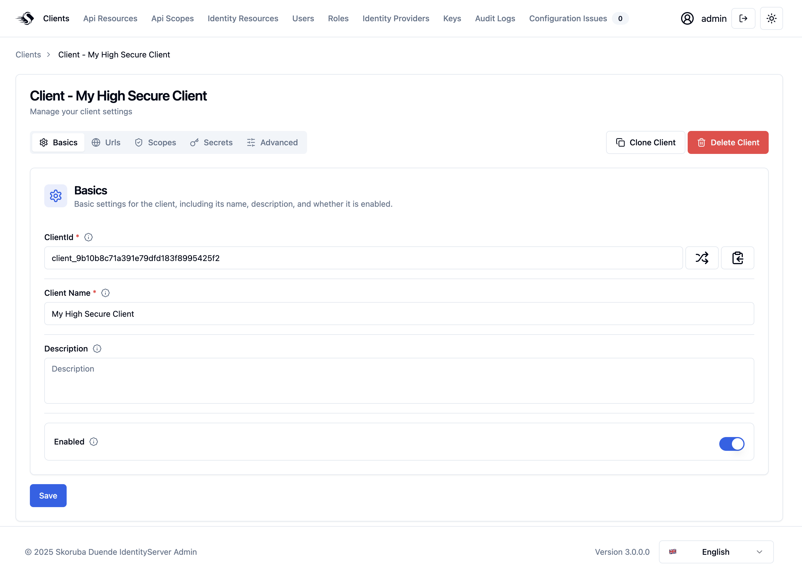

# Skoruba.Duende.IdentityServer.Admin v3 🚀

> Admin UI for Duende IdentityServer and ASP.NET Core Identity

## Project Status

[](https://discord.gg/qTqQCSKWkX)

### Stable production version 2.7.0

If you are looking for the latest stable production version, you can find it here:

➡️ [Skoruba.Duende.IdentityServer.Admin v2.7.0 (release branch)](https://github.com/skoruba/Duende.IdentityServer.Admin/tree/release/2.7.0)

## New release v3 is coming! 🎉

This application uses a modern **React** frontend (TypeScript, [Tailwind CSS](https://tailwindcss.com/) and [shadcn/ui](https://ui.shadcn.com/)) and a backend REST API built with **.NET 9**.

## Requirements

- [Install](https://www.microsoft.com/net/download/windows#/current) the latest .NET SDK (using older versions may lead to 502.5 errors when hosted on IIS or application exiting immediately after starting when self-hosted)

## Installation via dotnet new template

> 🔒 **Note:**  
> This project uses default database migrations, which will affect your database.  
> Always review the migrations for your database provider and create a database backup before proceeding.

### 1. Install the template

```sh
dotnet new install Skoruba.Duende.IdentityServer.Admin.Templates::3.0.0-preview.15
```

### 2. Create a new project

```sh
dotnet new skoruba.duende.isadmin \
  --name MyProject \
  --title MyProject \
  --adminemail "admin@example.com" \
  --adminpassword "P@ssword123" \
  --adminrole MyRole \
  --adminclientid MyClientId \
  --adminclientsecret MyClientSecret \
  --dockersupport true \
  --requirepushedauthorization true
```

## Template options

| Option                         | Description                                                                                                                                                                                                                                                                                                                                                                              |
| ------------------------------ | ---------------------------------------------------------------------------------------------------------------------------------------------------------------------------------------------------------------------------------------------------------------------------------------------------------------------------------------------------------------------------------------- |
| `--name`                       | Project name                                                                                                                                                                                                                                                                                                                                                                             |
| `--adminpassword`              | Admin password                                                                                                                                                                                                                                                                                                                                                                           |
| `--adminemail`                 | Admin email                                                                                                                                                                                                                                                                                                                                                                              |
| `--title`                      | Title and footer for the admin UI                                                                                                                                                                                                                                                                                                                                                        |
| `--adminrole`                  | Name of the admin role used for authorization                                                                                                                                                                                                                                                                                                                                            |
| `--adminclientid`              | Client ID used in Duende IdentityServer configuration for the admin client                                                                                                                                                                                                                                                                                                               |
| `--adminclientsecret`          | Client secret used in Duende IdentityServer configuration for the admin client                                                                                                                                                                                                                                                                                                           |
| `--dockersupport`              | Include Docker support (`true` / `false`)                                                                                                                                                                                                                                                                                                                                                |
| `--requirepushedauthorization` | Require Pushed Authorization Requests (PAR) for the admin client (`true` / `false`). Default: `true`. **Licensing note:** PAR is available in **Duende IdentityServer Business Edition or higher**. If you have a license lower than Business, set `--requirepushedauthorization` to `false`. More details about PAR [here](https://docs.duendesoftware.com/identityserver/tokens/par/). |

## Administration UI preview

- This administration uses [Tailwind CSS](https://tailwindcss.com/) and [shadcn/ui](https://ui.shadcn.com/) components.

### 🧭 Admin UI – Dashboard


### 🌙 Admin UI - Dark mode


### 🧙‍♂️ Client Creation – Wizard Flow


### 📋 Client Creation – Summary


### 💼 Client Management



### 📡 Monitoring

The Monitoring feature lets admins define and track configuration rules for clients, API resources, and identity resources. It can flag deprecated OAuth 2.1 flows, enforce required scopes, validate scope/resource naming conventions, and warn about expired client secrets.

### 🧱 Monitoring - Configuration Rules


### 🧩 Monitoring - Configuration Issues


### 📈 Monitoring - Dashboard


### Solution structure:


## Cloning

```sh
git clone https://github.com/skoruba/Duende.IdentityServer.Admin
```

## Running via Docker

- You can run the Admin UI using Docker.

### Docker Setup

#### DNS

You need local domain resolution for the project to work. This setup uses the domain `skoruba.local` (a fully qualified domain name, FQDN).  
Make sure `skoruba.local` resolves to your Docker host. For local-only usage, update your hosts file:

- **Linux:** `/etc/hosts`
- **Windows:** `C:\Windows\System32\drivers\etc\hosts`

Add the following entry:

```custom
127.0.0.1 skoruba.local sts.skoruba.local admin.skoruba.local admin-api.skoruba.local
```

This allows your host machine to resolve `skoruba.local` and its subdomains to itself.

#### Certificates

The project requires HTTPS certificates. Use [mkcert](https://github.com/FiloSottile/mkcert) to generate self-signed local certificates.

> If your domain is publicly available via DNS, you can use [Let's Encrypt](https://letsencrypt.org/). Nginx-proxy supports this, but it's not included in this setup.

##### Create the root certificate

On Windows, run `mkcert -install` as Administrator.  
Copy the CA Root certificate to the project to mount it into containers:

```bash
cd shared/nginx/certs
mkcert --install
copy $env:LOCALAPPDATA\mkcert\rootCA-key.pem ./cacerts.pem
copy $env:LOCALAPPDATA\mkcert\rootCA.pem ./cacerts.crt
```

##### Create the `skoruba.local` certificates

Generate a wildcard certificate for `skoruba.local` and subdomains. The certificate file names must match the domain names for nginx-proxy to work correctly. Both crt-key and pfx versions are needed:

```bash
cd shared/nginx/certs
mkcert -cert-file skoruba.local.crt -key-file skoruba.local.key skoruba.local *.skoruba.local
mkcert -pkcs12 skoruba.local.pfx skoruba.local *.skoruba.local
```

> This Docker setup is based on [bravecobra's repository](https://github.com/bravecobra/identityserver-ui) – thanks to [bravecobra](https://github.com/bravecobra)! 😊

### Run docker-compose

- The project contains `docker-compose.vs.debug.yml` and `docker-compose.override.yml` for debugging with a seeded environment.
- To start a seeded, debug-enabled environment (for Visual Studio):

```sh
docker-compose build
docker-compose up -d
```

> You can also set the `docker-compose` project as your startup project in Visual Studio.

### Docker images

- Docker images will be available on [Docker Hub](https://hub.docker.com/u/skoruba).

### Publish Docker images to Docker Hub

- Check the script in `build/publish-docker-images.ps1` and update the profile name as needed.

## EF Core & Data Access

- The solution uses these `DbContext` classes:

  - `AdminIdentityDbContext`: for ASP.NET Core Identity
  - `AdminLogDbContext`: for logging
  - `IdentityServerConfigurationDbContext`: for IdentityServer configuration store
  - `IdentityServerPersistedGrantDbContext`: for IdentityServer operational store
  - `AuditLoggingDbContext`: for audit logging
  - `IdentityServerDataProtectionDbContext`: for data protection

### Running Entity Framework migrations

> **Note:** Initial migrations are included in the repository.

- You can use the PowerShell script in the `build/add-migrations.ps1` folder.
- This script takes two arguments:
  - `--migration` (migration name)
  - `--migrationProviderName` (provider type — available choices: All, SqlServer, MySql, PostgreSQL)
- Example:
  ```sh
  .\add-migrations.ps1 -migration DbInit -migrationProviderName SqlServer
  ```

### Available database providers

- SqlServer
- MySql
- PostgreSQL

> You can switch the database provider via `appsettings.json`:

```json
"DatabaseProviderConfiguration": {
  "ProviderType": "SqlServer"
}
```

### Connection string samples

**PostgreSQL:**

```
Server=localhost;Port=5432;Database=DuendeIdentityServerAdmin;User Id=sa;Password=#;
```

**MySql:**

```
server=localhost;database=DuendeIdentityServerAdmin;user=root;password=#
```

### Seed data

- In `Program.cs` → `Main`, uncomment `DbMigrationHelpers.EnsureSeedData(host)`, or use the dotnet CLI (`dotnet run /seed`), or set `SeedConfiguration` in `appsettings.json`.
- The `Clients` and `Resources` sections in `identityserverdata.json` (section: `IdentityServerData`) contain initial data based on the Duende IdentityServer sample.
- The `Users` section in `identitydata.json` (section: `IdentityData`) contains the default admin username and password for first login.

## Authentication and Authorization

- Change the specific URLs and names for the IdentityServer and Authentication settings in `appsettings.json`
- In the controllers is used the policy which name is stored in - `AuthorizationConsts.AdministrationPolicy`. In the policy - `AuthorizationConsts.AdministrationPolicy` is defined required role stored in - `appsettings.json` - `AdministrationRole`.
- With the default configuration, it is necessary to configure and run instance of Duende IdentityServer. It is possible to use initial migration for creating the client as it mentioned above

## Azure Key Vault

You can use Azure Key Vault by configuring it in your `appsettings.json` as follows:

```json
"AzureKeyVaultConfiguration": {
  "AzureKeyVaultEndpoint": "",
  "ClientId": "",
  "ClientSecret": "",
  "UseClientCredentials": true
}
```

If your application is running in **Azure App Service**, simply specify `AzureKeyVaultEndpoint`.  
For applications running **outside of Azure**, use the client credentials flow:  
Register a new application in the Azure Portal, connect it to Azure Key Vault, and set up the client secret.

Azure Key Vault can be used for the following parts of the application:

---

### Application Secrets and Database Connection Strings

To store configuration in Azure Key Vault, enable the following setting:

```json
"AzureKeyVaultConfiguration": {
  "ReadConfigurationFromKeyVault": true
}
```

---

### Data Protection

Enable Azure Key Vault for data protection with:

```json
"DataProtectionConfiguration": {
  "ProtectKeysWithAzureKeyVault": true
}
```

Then, specify the key identifier:

```json
"AzureKeyVaultConfiguration": {
  "DataProtectionKeyIdentifier": ""
}
```

---

### IdentityServer Certificate for Signing Tokens

Generate a new certificate in Azure Key Vault and set its name in your configuration:

```json
"AzureKeyVaultConfiguration": {
  "IdentityServerCertificateName": ""
}
```

## Logging

This project uses **Serilog** for logging. The following sinks are pre-configured (see `serilog.json`):

- Console
- File
- MSSqlServer
- Seq

Example `serilog.json` configuration:

```json
{
  "Serilog": {
    "MinimumLevel": {
      "Default": "Error",
      "Override": {
        "Skoruba": "Information"
      }
    },
    "WriteTo": [
      {
        "Name": "Console"
      },
      {
        "Name": "File",
        "Args": {
          "path": "log.txt",
          "rollingInterval": "Day"
        }
      },
      {
        "Name": "MSSqlServer",
        "Args": {
          "connectionString": "...",
          "tableName": "Log",
          "columnOptionsSection": {
            "addStandardColumns": ["LogEvent"],
            "removeStandardColumns": ["Properties"]
          }
        }
      }
      // You can also add Seq or other sinks as needed
    ]
  }
}
```

> You can customize or add sinks as needed by editing the `serilog.json` file.

## Audit Logging

- This solution uses audit logging via [skoruba/AuditLogging](https://github.com/skoruba/AuditLogging).  
  _(See the link for more details about the implementation.)_

- In the Admin UI project, audit logging is set up as follows:

```csharp
services.AddAuditLogging(options => { options.Source = auditLoggingConfiguration.Source; })
    .AddDefaultHttpEventData(
        subjectOptions =>
        {
            subjectOptions.SubjectIdentifierClaim = auditLoggingConfiguration.SubjectIdentifierClaim;
            subjectOptions.SubjectNameClaim = auditLoggingConfiguration.SubjectNameClaim;
        },
        actionOptions =>
        {
            actionOptions.IncludeFormVariables = auditLoggingConfiguration.IncludeFormVariables;
        })
    .AddAuditSinks<DatabaseAuditEventLoggerSink<TAuditLog>>();

// repository for library
services.AddTransient<IAuditLoggingRepository<TAuditLog>, AuditLoggingRepository<TAuditLoggingDbContext, TAuditLog>>();

// repository and service for admin
services.AddTransient<IAuditLogRepository<TAuditLog>, AuditLogRepository<TAuditLoggingDbContext, TAuditLog>>();
services.AddTransient<IAuditLogService, AuditLogService<TAuditLog>>();
```

---

### Admin Configuration

Admin and STS can be customized without editing code, in the `appsettings.json` under the `AdminConfiguration` section.

---

### Audit Logging Configuration

In `appsettings.json`:

```json
"AuditLoggingConfiguration": {
  "Source": "IdentityServer.Admin.Web",
  "SubjectIdentifierClaim": "sub",
  "SubjectNameClaim": "name",
  "IncludeFormVariables": false
}
```

The `Skoruba.Duende.IdentityServer.Admin.BusinessLogic` layer contains a folder called `Events` for audit logging.  
In each service method, `LogEventAsync` is called, for example:

```csharp
await AuditEventLogger.LogEventAsync(new ClientDeletedEvent(client));
```

The final audit log is available in the table `dbo.AuditLog`.

---

## Login Configuration

In `Skoruba.Duende.IdentityServer.STS.Identity/appsettings.json` you can specify which column will be used for login (`Username` or `Email`):

```json
"LoginConfiguration": {
  "ResolutionPolicy": "Username"
}
```

or

```json
"LoginConfiguration": {
  "ResolutionPolicy": "Email"
}
```

---

## Register Configuration

In `Skoruba.Duende.IdentityServer.STS.Identity/appsettings.json` you can disable user registration (`default: true`):

```json
"RegisterConfiguration": {
  "Enabled": false
}
```

---

## How to configure API & Swagger

- By default, the API runs on `https://localhost:44302` and Swagger UI is available at `https://localhost:44302/swagger`.
- The Swagger UI is configured with a client and API in STS:

```json
"AdminApiConfiguration": {
  "IdentityServerBaseUrl": "https://localhost:44310",
  "OidcSwaggerUIClientId": "skoruba_identity_admin_api_swaggerui",
  "OidcApiName": "skoruba_identity_admin_api"
}
```

---

## How to configure an external provider in STS

In `Skoruba.Duende.IdentityServer.STS.Identity/Helpers/StartupHelpers.cs`, the method `AddExternalProviders` contains examples for configuring providers like GitHub and AzureAD via `appsettings.json`:

```json
"ExternalProvidersConfiguration": {
  "UseGitHubProvider": false,
  "GitHubClientId": "",
  "GitHubClientSecret": "",
  "UseAzureAdProvider": false,
  "AzureAdClientId": "",
  "AzureAdTenantId": "",
  "AzureInstance": "",
  "AzureAdSecret": "",
  "AzureAdCallbackPath": "",
  "AzureDomain": ""
}
```

You can extend `ExternalProvidersConfiguration` with additional properties as needed.

If you use the DockerHub built image, you can configure these providers via `appsettings` without code changes:

- GitHub
- AzureAD

#### List of external providers for ASP.NET Core:

- [aspnet-contrib/AspNet.Security.OAuth.Providers](https://github.com/aspnet-contrib/AspNet.Security.OAuth.Providers)
- [Microsoft Docs: Social authentication](https://docs.microsoft.com/en-us/aspnet/core/security/authentication/social/)

#### Azure AD

- Great article on setting up Azure AD:  
  [Quickstart: Sign in users in ASP.NET Core web apps](https://docs.microsoft.com/en-us/azure/active-directory/develop/quickstart-v2-aspnet-core-webapp)

---

## Email Service

You can configure email delivery via:

### SendGrid

In the STS project (`appsettings.json`):

```json
"SendgridConfiguration": {
  "ApiKey": "",
  "SourceEmail": "",
  "SourceName": ""
}
```

### SMTP

```json
"SmtpConfiguration": {
  "From": "",
  "Host": "",
  "Login": "",
  "Password": ""
}
```

## Health checks

- AdminUI, AdminUI Api and STS contain endpoint `health`, which check databases and IdentityServer.

## Localizations - labels, messages

- The project has following translations:
  - English

#### Feel free to send a PR with your translation. ☺️

- All labels and messages are stored in the translations.json - locatated in `/i18n`

## Tests

- The solution contains unit and integration tests.

## Overview

- STS:

  - `Skoruba.Duende.IdentityServer.STS.Identity` - project that contains the instance of Duende.IdentityServer and combine these samples - [Quickstart UI for the Duende.IdentityServer with Asp.Net Core Identitye](https://github.com/DuendeSoftware/IdentityServer/tree/main/hosts/AspNetIdentity) and [Quickstart UI for the Duende.IdentityServer with EF Core storage](https://github.com/DuendeSoftware/IdentityServer/tree/main/hosts/EntityFramework) and [damienbod - IdentityServer4 and Identity template](https://github.com/damienbod/IdentityServer4AspNetCoreIdentityTemplate)

## Admin UI API

- `Skoruba.Duende.IdentityServer.Admin.Api` – Provides a REST API for managing Duende IdentityServer and ASP.NET Core Identity data, with integrated Swagger support.

## Admin UI

- `Skoruba.Duende.IdentityServer.Admin` – Main .NET project that references the SPA and UI packages.
- `Skoruba.Duende.IdentityServer.Admin.UI` – Provides services and configuration for the Admin UI application.
- `Skoruba.Duende.IdentityServer.Admin.UI.Spa` – Contains precompiled Admin UI assets.

## Business Logic

- `Skoruba.Duende.IdentityServer.Admin.BusinessLogic` – Contains DTOs, repositories, services, and mappers for Duende IdentityServer.
- `Skoruba.Duende.IdentityServer.Admin.BusinessLogic.Identity` – Contains DTOs, repositories, services, and mappers for ASP.NET Core Identity.
- `Skoruba.Duende.IdentityServer.Admin.BusinessLogic.Shared` – Contains shared DTOs and exception handling for Duende IdentityServer and ASP.NET Core Identity.

## Shared

- `Skoruba.Duende.IdentityServer.Shared` – Provides shared Identity DTOs for the Admin UI, Admin UI API, and STS.
- `Skoruba.Duende.IdentityServer.Shared.Configuration` – Provides shared configuration for the Admin UI, Admin UI API, and STS.

## Entity Framework

- `Skoruba.Duende.IdentityServer.Admin.EntityFramework` – EF Core data layer containing entities for Duende IdentityServer.
- `Skoruba.Duende.IdentityServer.Admin.EntityFramework.Configuration` – EF Core data layer containing entity configurations.
- `Skoruba.Duende.IdentityServer.Admin.EntityFramework.Identity` – EF Core data layer containing repositories for ASP.NET Core Identity.
- `Skoruba.Duende.IdentityServer.Admin.EntityFramework.Extensions` – Provides extensions related to Entity Framework.
- `Skoruba.Duende.IdentityServer.Admin.EntityFramework.Shared` – Provides DbContexts for Duende IdentityServer, logging, and ASP.NET Core Identity, including shared Identity entities.
- `Skoruba.Duende.IdentityServer.Admin.EntityFramework.SqlServer` – Contains database migrations for SQL Server.
- `Skoruba.Duende.IdentityServer.Admin.EntityFramework.MySql` – Contains database migrations for MySQL.
- `Skoruba.Duende.IdentityServer.Admin.EntityFramework.PostgreSQL` – Contains database migrations for PostgreSQL.

## Tests

- `Skoruba.Duende.IdentityServer.Admin.Api.IntegrationTests` – xUnit project providing integration tests for the Admin UI API.
- `Skoruba.Duende.IdentityServer.Admin.UnitTests` – xUnit project providing unit tests for the Admin UI.
- `Skoruba.Duende.IdentityServer.STS.IntegrationTests` – xUnit project providing integration tests for the STS.

## Duende.IdentityServer

**Clients**

It is possible to define the configuration according the client type - by default the client types are used:

- Web Application - Authorization Code Flow with PKCE
- Machine/Robot - Client Credentials flow

- Entities:
  - Client Cors Origins
  - Client Grant Types
  - Client IdP Restrictions
  - Client Post Logout Redirect Uris
  - Client Properties
  - Client Redirect Uris
  - Client Scopes
  - Client Secrets

**API Resources**

- Entities:
  - Api Claims
  - Api Scopes
  - Api Scope Claims
  - Api Secrets
  - Api Properties

**Identity Resources**

- Entities:
  - Identity Claims
  - Identity Properties

## Asp.Net Core Identity

**Users**

- Entities:
  - User Roles
  - User Logins
  - User Claims

**Roles**

- Entities:
  - Role Claims

## Roadmap

### 1.0.0:

- [x] Create the Business Logic & EF layers - available as a nuget package
- [x] Create a project template using dotnet CLI - `dotnet new template`
  - [x] First template: The administration of the Duende.IdentityServer and Asp.Net Core Identity
- [x] Add logging into
  - [x] Database
  - [x] File
  - [x] Seq
- [x] Add localization for other languages
  - [x] English
  - [x] Chinese
  - [x] Russian
  - [x] Persian
  - [x] Swedish
  - [x] Danish
  - [x] Spanish
  - [x] French
  - [x] Finish
- [x] Manage profile
- [x] Password reset
- [x] Link account to an external provider (example with Github)
- [x] Two-Factor Authentication (2FA)
- [x] User registration
- [x] Email service
  - [x] SendGrid
- [x] Add API
  - [x] Duende.IdentityServer
  - [x] Asp.Net Core Identity
  - [x] Add swagger support
- [x] Add audit logs to track changes ([#61](https://github.com/skoruba/IdentityServer4.Admin/issues/61))
- [x] Docker support ([#121](https://github.com/skoruba/IdentityServer4.Admin/issues/121))
- [x] Health Checks (Databases and IdentityServer)
- [x] Support for multiple database providers (SqlServer, Mysql, PostgreSQL)
- [x] Simplify Admin Identity middleware ([#430](https://github.com/skoruba/IdentityServer4.Admin/issues/430))
- [x] Add support for loading signing key from Azure Key Vault ([#533](https://github.com/skoruba/IdentityServer4.Admin/issues/533))
- [x] Protect keys for dataprotection from Azure Key Vault ([#715](https://github.com/skoruba/IdentityServer4.Admin/pull/715))
- [x] Update to Duende.IdentityServer version 4 ([#633](https://github.com/skoruba/IdentityServer4.Admin/issues/633))
- [x] Add support for themes ([#725](https://github.com/skoruba/IdentityServer4.Admin/issues/725))
- [x] Extract UI part into nuget package ([#770](https://github.com/skoruba/IdentityServer4.Admin/issues/770), [#409](https://github.com/skoruba/IdentityServer4.Admin/issues/409), [#55](https://github.com/skoruba/IdentityServer4.Admin/issues/55), [#322](https://github.com/skoruba/IdentityServer4.Admin/issues/322), [#28](https://github.com/skoruba/IdentityServer4.Admin/issues/28), [#133](https://github.com/skoruba/IdentityServer4.Admin/issues/133))

### 1.1.0

- [x] Update to .NET 6
- [x] Update to Duende IdentityServer v6

### 1.2.0

- [x] Update to Duende IdentityServer 6.2.1
- [x] Add support for Dynamic Identity Providers

### 2.0.0

- [x] Update to .NET 8 ([#180](https://github.com/skoruba/Duende.IdentityServer.Admin/issues/180))
- [x] Update to IdentityServer v7 ([#181](https://github.com/skoruba/Duende.IdentityServer.Admin/issues/181))

### 2.1.0

- [x] Role users pagination ([#169](https://github.com/skoruba/Duende.IdentityServer.Admin/issues/169))
- [x] Add secure secret generation with 'secret\_' prefix ([#153](https://github.com/skoruba/Duende.IdentityServer.Admin/issues/153))
- [x] Increase client name prominence ([#154](https://github.com/skoruba/Duende.IdentityServer.Admin/issues/154))
- [x] Added support for generation typescript client definition for API endpoints ([#215](https://github.com/skoruba/Duende.IdentityServer.Admin/issues/215))
- [x] Add new endpoints to API for client, api resource, api scopes validations and lists ([#213](https://github.com/skoruba/Duende.IdentityServer.Admin/issues/213))

- [x] Use named arguments in .AddIdentityServer() healthchecks ([#201](https://github.com/skoruba/Duende.IdentityServer.Admin/issues/201))
- [x] Change the AdminIdentityDbContext tablenames to be derived from appsettings ([#196](https://github.com/skoruba/Duende.IdentityServer.Admin/issues/196))
- [x] Raise UserLoginSuccessEvent when logging in with 2fa or recovery code ([#202](https://github.com/skoruba/Duende.IdentityServer.Admin/issues/202))

### 2.2.2

- [x] Create a New Project `Skoruba.Duende.IdentityServer.Admin.UI.Api` to be Shipped as a NuGet Package
- [x] Fix DockerFile for All Projects for Multiplatform Builds `(linux/amd64, linux/arm64)` ([#194](https://github.com/skoruba/Duende.IdentityServer.Admin/issues/194))
- [x] Add a New API Endpoint for Dashboard View
- [x] Fix Import of dayjs for NSwag TypeScript Definition

### 2.3.0

- [x] Fix Dashboard endpoint for getting Identity data
- [x] Update solution to the latest version of all nuget packages, including `Duende.IdentityServer` version `7.0.5`

### 2.4.0

- [x] Method CanInsert..Property of the controllers always return true ([#235](https://github.com/skoruba/Duende.IdentityServer.Admin/issues/235))
- [x] Skoruba.Duende.IdentityServer.Shared.Configuration - replace deprecated Microsoft.Extensions.Configuration.AzureKeyVault package with Azure.Extensions.AspNetCore.Configuration.Secrets ([#234](https://github.com/skoruba/Duende.IdentityServer.Admin/issues/234))
- [x] Can't update client because "Client Id _clientId_ already exists" ([#227](https://github.com/skoruba/Duende.IdentityServer.Admin/issues/227))
- [x] Migrate from Microsoft.Azure.KeyVault to the new Azure Key Vault API ([#224](https://github.com/skoruba/Duende.IdentityServer.Admin/issues/224))
- [x] Docker Compose NGINX targeting wrong port ([#222](https://github.com/skoruba/Duende.IdentityServer.Admin/issues/222))
- [x] Update all nuget packages to the latest versions, including Duende IdentityServer version 7.0.7. (fixed [CVE-2024-39694](https://github.com/advisories/GHSA-ff4q-64jc-gx98)) - ([#236](https://github.com/skoruba/Duende.IdentityServer.Admin/issues/236))

### 2.5.0

- [x] Delete user from admin panel of admin app returns an error ([#214](https://github.com/skoruba/Duende.IdentityServer.Admin/issues/214))

### 2.6.0

- [x] Update to .NET 9 and the latest version of Duende IdentityServer 7.2.1 ([#250](https://github.com/skoruba/Duende.IdentityServer.Admin/issues/250))

### 3.0.0

- [x] New UI in React and Typescript ([#182](https://github.com/skoruba/Duende.IdentityServer.Admin/issues/182))
- [x] Add wizard for client registration ([#18](https://github.com/skoruba/Duende.IdentityServer.Admin/issues/18))
- [x] Migrate STS from Bootstrap to Tailwind CSS (align with Admin UI design 🎨), replace Gulp with modern tooling.

### 3.1.0

- [ ] Update to .NET 10
- [ ] Add support for PassKeys

### 3.2.0

- [ ] Refactoring DTOs and ApiDTOs – consider removing AutoMapper
- [ ] Add more translations to new frontend pages

### 3.3.0

- [ ] Add management for claims ([#22](https://github.com/skoruba/Duende.IdentityServer.Admin/issues/22))

### 4.0.0

- [ ] Rewrite API controllers as Minimal API endpoints using VSA (Vertical Slice Architecture)

## Licence

This repository is licensed under the terms of the [**Apache License 2.0**](LICENSE).

### Duende.IdentityServer License 🔑

**Duende.IdentityServer** is available under both a **FOSS (RPL) and a commercial** license.

For the production environment is necessary to get the specific license. For more information about licensing of Duende.IdentityServer - please check [this link](https://duendesoftware.com/products/identityserver#pricing).

This repository uses the source code from https://github.com/DuendeSoftware/IdentityServer.Quickstart.UI which is under the terms of the following
[**license**](https://github.com/DuendeSoftware/IdentityServer.Quickstart.UI/blob/main/LICENSE).

## Acknowledgements

Thanks to [Tomáš Hübelbauer](https://github.com/TomasHubelbauer) for the initial code review.

Thanks to [Dominick Baier](https://github.com/leastprivilege) and [Brock Allen](https://github.com/brockallen) - the creators of Duende.IdentityServer.

## Contributors

Thanks goes to these wonderful people https://github.com/skoruba/Duende.IdentityServer.Admin/graphs/contributors. 👍🏻

Contributions of any kind are welcome!

## Contact and Suggestion

I am happy to share my implementation of the administration for Duende.IdentityServer and ASP.NET Core Identity.

Any feedback is welcome - feel free to create an issue or send me an email - [jan@skoruba.com](mailto:jan@skoruba.com). Thank you ☺️

## Support and Donation 🕊️

If you like my work, you can support me by donation. 👍

### Github

https://github.com/sponsors/skoruba

### Paypal

https://www.paypal.me/skoruba

### Patreon

https://www.patreon.com/skoruba
